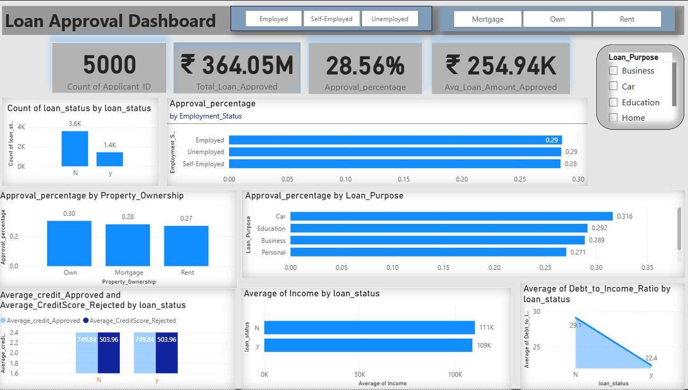

# Loan Approval Analysis Dashboard (SQL + Power BI)

### Project Overview
This project focuses on **Exploratory Data Analysis (EDA)** of loan approval patterns using applicants’ financial and demographic data.  
It was built with **SQL** for data preprocessing and **Power BI** for visualization.  

Additional calculated columns were created in **SQL** — such as total income, debt-to-income ratio, and approval flag — to enhance data analysis and improve visualization in Power BI.  
In **Power BI**, **DAX (Data Analysis Expressions)** were applied to create key measures like approval percentage, average approved amount, and total loan value to derive deeper insights.  
All DAX measures used are listed in the file [`loan_approval_dax_measures.txt`](loan_approval_dax_measures.txt).

The dataset used is **“Loan Approval Dataset”** from Kaggle, available here:  
🔗 [Loan Approval Dataset – Kaggle](https://www.kaggle.com/datasets/suryadeepthi/loan-approval-dataset)

> **Note:**  
> The dataset contained additional columns such as *Age, Application ID, Interest Rate, Loan Amount, Loan Term, Marital Status, Number of Dependents,* and *Previous Defaults*.  
> These were excluded from the final dashboard as the analysis primarily focused on financial and behavioral factors (like income, debt-to-income ratio, employment type, and property ownership) that directly influence loan approval outcomes.

---

###  Objectives
- Perform exploratory data analysis (EDA) to identify key factors influencing loan approvals.  
- Analyze approval percentage by employment type, property ownership, and loan purpose.  
- Study the impact of income and debt-to-income ratio on approvals.  

---

###  Key Insights
- Total applicants analyzed: **5,000**  
- Overall loan approval rate: **28.56 %** (₹364.05 M approved).  
- **Employed** applicants had the highest approval rate (29 %).  
- **Owned properties** showed slightly higher approvals than rented or mortgaged.  
- **Home loans** had the highest approval percentage (~31.6 %).  
- **Lower debt-to-income ratios** were strongly linked to approved loans.  
- **Approved applicants** typically had higher income and more stable employment.  

---

###  Tools Used
- **SQL:** Data cleaning, transformation, and creation of calculated columns (e.g., total income, debt-to-income ratio, approval flag).  
- **Power BI:** Dashboard design, interactive visuals, and KPI cards.  
- **DAX (Data Analysis Expressions):** Created key measures such as approval percentage, average approved amount, and total loan value for deeper insights.  
- **Microsoft Excel:** For initial data exploration and validation.  

---

###  Dashboard Snapshots
| Dashboard View | Description |
|----------------|-------------|
|  | Main overview showing KPIs and filters |
|  | Approval % by Employment Status |
|  | Approval % by Property Ownership |
|  | Loan Approval % by Loan Purpose |
|  | Average Credit Approved vs Rejected |
|  | Average Debt-to-Income Ratio by Loan Status |

---
### Summary
This project demonstrates the practical application of **SQL**, **Power BI**, and **DAX** in analyzing real-world financial data.  
The goal was to explore loan approval trends through data-driven insights and visualize the impact of factors such as income, debt-to-income ratio, employment type, and property ownership.  
It reflects hands-on experience in performing **Exploratory Data Analysis (EDA)**, creating calculated measures in **DAX**, and building an interactive **Power BI dashboard** that translates raw data into actionable business insights.  

---

**Created by:** *Poojitha M*  
💼 *Business Analyst & Data Analytics Enthusiast*  
📊 *This project was developed to strengthen analytical and visualization skills for professional growth.*

